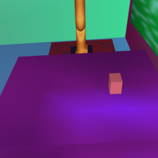
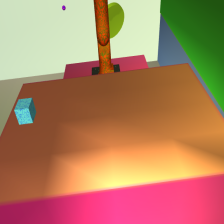
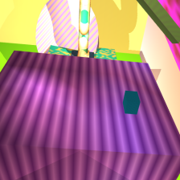
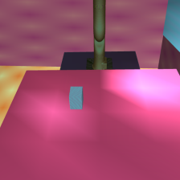
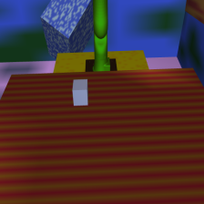
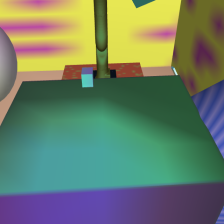
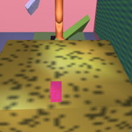
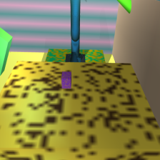
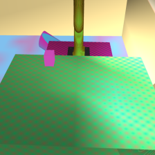

# Reproducing Domain Randomization for Sim-to-Real
Reproducing [[Domain Randomization for Transferring Deep Neural Networks from Simulation to the Real World]](https://arxiv.org/abs/1703.06907)


## Intro

This repository contains my implementation of domain randomization setup
for training an object localization model in simulation to adapt to the real 
world.  I was implementing this as part of a larger research project, and decided
to publish this in case others may find it useful.

I use the KUKA LBR4 arm ([video](https://youtu.be/wu7q5IZRJTA)) instead of the Fetch 
robot that was used in OpenAI's initial domain randomization work.  

I show that I am able to get average 3.7cm accuracy in the real world
with a model trained purely in simulation.  I suspect I could improve
this accuracy to be on par with the 1.5cm reported in the original paper, 
by doing better calibration to the real world and randomizing some more relevant 
aspects of the visuals.  But I figured the results are good enough for purposes
of showing it works, and 3.7cm is still quite good for the bigger table
(with large range of positions) I was using.


**Table of Contents**
- [Results](#results)
- [Setup](#setup)
- [Instructions](#instructions)
- [Mujoco Tips](#mujoco-tips)


## Results

**Training**

I randomize the textures, lighting, camera position and orientation (slightly around
the real world), and I train the model to predict the cube XYZ coordinates (with
fixed height, so Z is always the same, as in the paper).

**Example training images**

 









 








**Evaluation**

To evaluate my system, I collected [54 images](./data/real) from the real world
with a cube placed in uniformly spaced positions on a table in front of the
robot arm.  I run the model trained in simulation on each of these images, 
and achieve an average error of 3.7cm.  I show examples from various 
percentiles with 100 being the best prediction (under 1 cm error) and 0 
being the worst prediction (45 cm error).  Note that the worst results come from 
the object being on the edge of the table, and that despite a few outliers, 
the model is pretty accuracte.  

NOTE: that I only use the XY coordinates in calculating error, since the height
is always the same. This provides a more fair estimation of model accuracy.


**Plots for percentiles of model accuracy (best = 100, worst = 0)**

100 |  90 |  80  | 70
:------:|:---------:|:----------:|:----:|
  |   |  | 

50 |  20 |  10  | 0
:------:|:---------:|:----------:|:----:|
  |   |  | 


## Setup

Follow the instructions at the [mujoco\_py](https://github.com/openai/mujoco-py)
repo.  Installation can be a pain, and see the tips [below](#mujoco) for some GitHub
issues to check out if you have any problems with installation.

You may have to install some extra packages (see my [`apt.txt`](./apt.txt) for 
a (partial) list of these).  


To install the python dependencies:
```
pip install -r requirements.txt
```

### Running demos

Once you have mujoco\_py installed, you should try running the randomization demos.
These only depend on mujoco\_py and can help you ensure that you have installed
it correctly.

```python
python3 demos/disco_kuka.py

# or

python3 demos/disco_fetch.py
```


## Instructions

**Generating data**
```
python3 run_domrand.py

# or

python3 run_domrand.py --gui 1  # to visualize results, but not write to file

# And you can just kill it when you are done. 
# My code handles file closing for imcomplete writes, but can sometimes cause data corruptoins. 
# To be safe, after running the script, you can run:

python3 scripts/find_corruption.py
```
I generally generate and test with about 100 files (100k images) for good 
measure, but I have not done a thorough test of how many are really required
for good performance.  I suspect 50k images would give similar results and that
you could likely get away with 20k.


**Running model**

```
python3 run_training.py --num_files=100
```

This will train a model in about 3 hours (about 8 epochs) on a GTX 1080 Ti GPU.

You can monitor training progress and results using TensorBoard. The default
is to log into the `checkpoint` folder.  See [`sim2real/define_flags.py`](./sim2real/define_flags.py) or
`python3 run_training.py --help` for script settings.


<a name="mujoco"></a>

## Mujoco Tips
- READ [THIS](https://github.com/openai/mujoco-py/pull/145#issuecomment-356938564) if you are getting ERROR: GLEW initialization error: Missing GL version
- You need to call sim.forward() or sim.step() to get the camera and light modders to update
- You can't scale a mesh after it has been loaded (http://www.mujoco.org/forum/index.php?threads/how-to-scale-already-exist-model.3483/)
- Read this: https://github.com/openai/mujoco-py/issues/148 and this: https://github.com/openai/gym/issues/234
- The maximum number of lights that can be active simultaneously is 8, counting the headlight
- More documentation on lighting can be found here: http://www.glprogramming.com/red/chapter05.html#name10
- To make it so cameras don't look through walls, you need to add:

```
  <visual>
    <map znear=0.01 /> 
  </visual>
```

